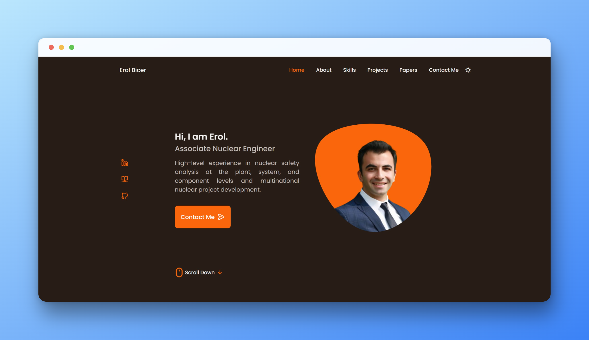

# Erol Bicer's Responsive Portfolio Website
## Website URL: www.erolbicer.com

- The design is based on [Bedimcode](https://github.com/bedimcode)
- The resume is created on [FlowCV](https://flowcv.com/)
- The email service provider is [EmailJs](https://www.emailjs.com/)
- Contact form validations are added using [JavaScript](https://www.youtube.com/watch?v=fz8bwvn9lA4) 
- Normal alerts are replaced with Sweet Alert [SweetAlert](https://sweetalert.js.org)
- The favicon generator is [favicon.io](https://favicon.io/favicon-generator/)
- The Open Graph Meta Tags are added [Open Graph](https://ogp.me/)
- Videos are embedded from [YouTube](https://www.youtube.com)
- Presentations are  embedded from [Beautiful.ai](https://www.beautiful.ai)
- Added Google Tag script for [Google Analytics](https://analytics.google.com)
- Online meeting integration by [Calendly](https://calendly.com/)

### Landing Page Light

### Landing Page Dark

